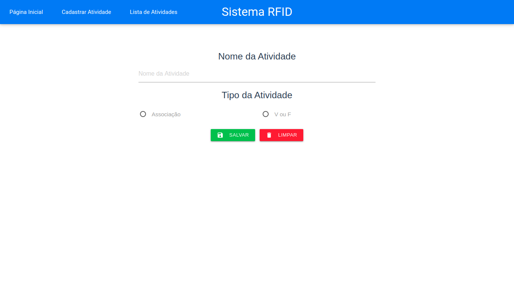
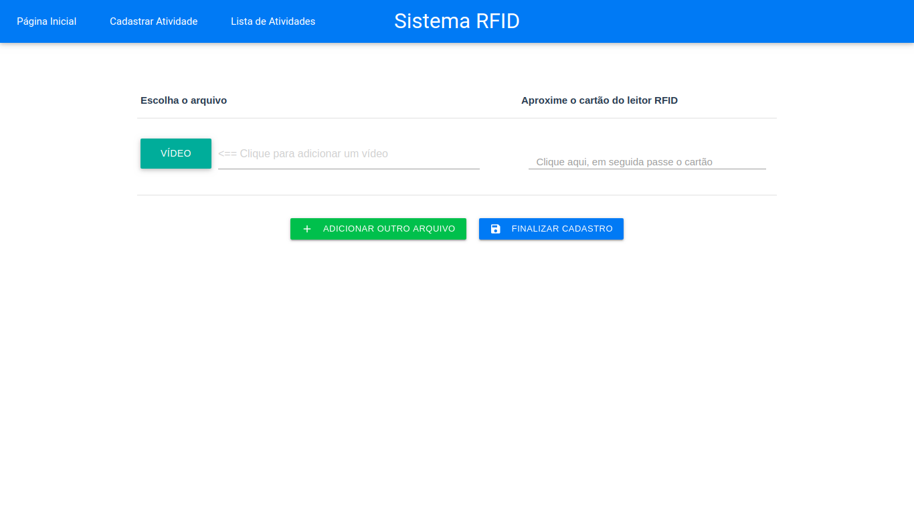
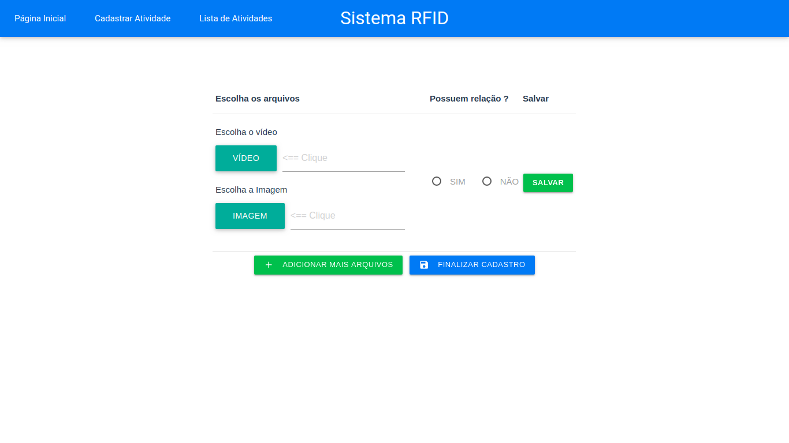
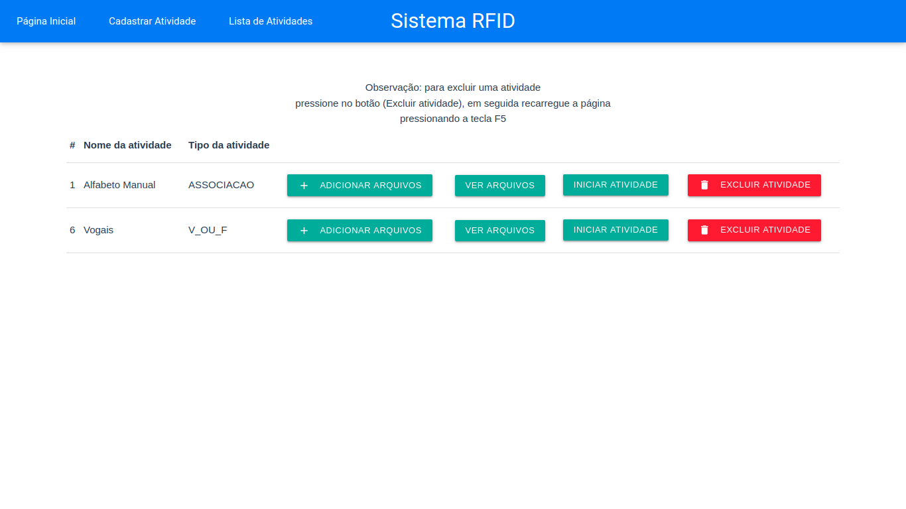

# app-vue-rfid

# Telas do sistema
Cadastrar nova atividade

Adicionar arquivo na atividade do tipo Associaço

Adicionar arquivo na atividade do tipo V ou F

Excluir arquivo específico

Listagem das atividades criadas

